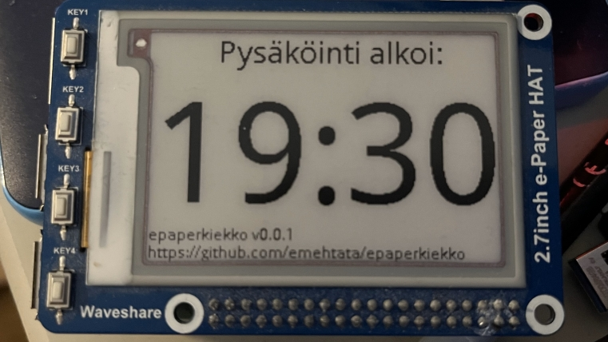

# epaperkiekko - pysäköintikiekko

Huom: Tämä versio on vielä PoC eikä testattu kenttäolosuhteissa.

Tämä python-skripti ohjelmoi Waveshare 2,7-tuuman epaper-näytön näyttämään kelloajan seuraavaan tasa- tai puoleen tuntiin, eli sitä voi käyttää automaattisena pysäköintikiekkona.

## Tarvikkeet

* Raspberry Pi (3/4/5)
* epaper-näyttö (Waveshare 2,7", https://www.waveshare.com/2.7inch-e-paper-hat.htm)
* OS, jossa valmiiksi konfattu python3 epaperpi-kirjastoineen (tämän dokumentin ulkopuolella)
* Nettiyhteys konfiguroituna (kellon synkronointia varten), esim. jakamalla puhelimen hotspotilla

## Käyttö

Lisää crontab (muuta polku omalle ympäristöllesi):

    @reboot sleep 10 && cd /home/pi/work/epaperkiekko && python3 main.py
    */30 * * * * cd /home/rpi/work/epaperkiekko && python3 main.py

Autossa:

1. Varmista, että sinulla on toimiva nettiyhteys jaettuna Raspberry Pille
1. Kytke usb-johto syöttämään virta Raspberry Pille
1. Lähde ajamaan
1. Näyttö päivittyy laitteen käynnistyttyä sekä tasa- ja puolitunnein (ks. edellinen crontab-tiedosto)
1. Pysäköi auto
1. Irrota Raspberry Pi virransyötöstä (useimmiten auton sammuttaminen riittää) ja aseta se kojelaudalle. Se näyttää nyt automaattisesti seuraavaa tasa- tai puolta tuntia, kuten pysäköintikiekon kuuluukin \o/
1. Kun olet hoitanut asiasi, palaa kohtaan 1.

## Testaus

    python3 main.py (Aika järjestelmän kellosta)

    python3 main.py HH:MM (Aika komentoriviparametrina)

## TODO

* Riippuvuus Croniin pois
* Docker
