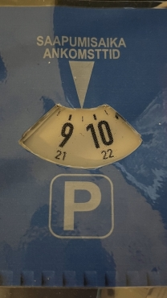

# epaperkiekko - pysäköintikiekko

## Kiekkoversio (analog)

Tämä python-ohjelma ohjelmoi Waveshare 2,7-tuuman epaper-näytön näyttämään pysäköintikiekon "kiekko"-osan alaosaa, eli sitä voi käyttää automaattisena pysäköintikiekkona vanhanaikaisen pysäköintikiekon kehyksen kanssa.

## Digitaalikelloversio (digital)

Tämä python-ohjelma ohjelmoi Waveshare 2,7-tuuman epaper-näytön näyttämään kellonajan seuraavaan tasa- tai puoleen tuntiin, eli sitä voi käyttää automaattisena pysäköintikiekkona.

## Tarvikkeet

* Raspberry Pi (3/4/5)
* epaper-näyttö ( tuettu Waveshare 2,7" b-version, https://www.waveshare.com/2.7inch-e-Paper-HAT-B.htm )
* Nettiyhteys konfiguroituna (kellon synkronointia varten), esim. jakamalla puhelimen hotspotilla

## Käyttö

Oletuksena käännetään ja ajetaan analogista versiota.

Kiekon version voi määrittää ympäristömuuttujalla `VER`, joka voi olla joko "analog" tai "digital".

Käännä image:

    make (VER=analog/digital) build

Käynnistä kontti:

    make (VER=analog/digital) run

Lisää tietoja `Makefile`-tiedostossa.

Autossa:

1. Varmista, että sinulla on toimiva nettiyhteys jaettuna Raspberry Pille
1. Kytke usb-johto syöttämään virta Raspberry Pille
1. Lähde ajamaan
1. Näyttö päivittyy laitteen käynnistyttyä sekä tasa- ja puolitunnein
1. Pysäköi auto
1. Irrota Raspberry Pi virransyötöstä (useimmiten auton sammuttaminen riittää) ja aseta se kojelaudalle. Se näyttää nyt automaattisesti seuraavaa tasa- tai puolta tuntia, kuten pysäköintikiekon kuuluukin \o/
1. Kun olet hoitanut asiasi, palaa kohtaan 1.

Nappien toiminnot vasemmalta ylhäältä alas digitaalisessa versiossa:
* Aseta teksti "Saapumisaika" (Oletus)
* Aseta teksti "Ankomstid"
* Aseta teksti "Pysäköinti alkoi"
* Näytä kellonaika

## Testaus

`cd analog` TAI `cd digital`

    python3 main.py (Aika järjestelmän kellosta)

    python3 main.py HH:MM (Aika komentoriviparametrina)

## TODO

* Tallenna asetukset ja lue ne käynnistyksessä
* Asenna my_epaper moduulina ennen käyttöä
